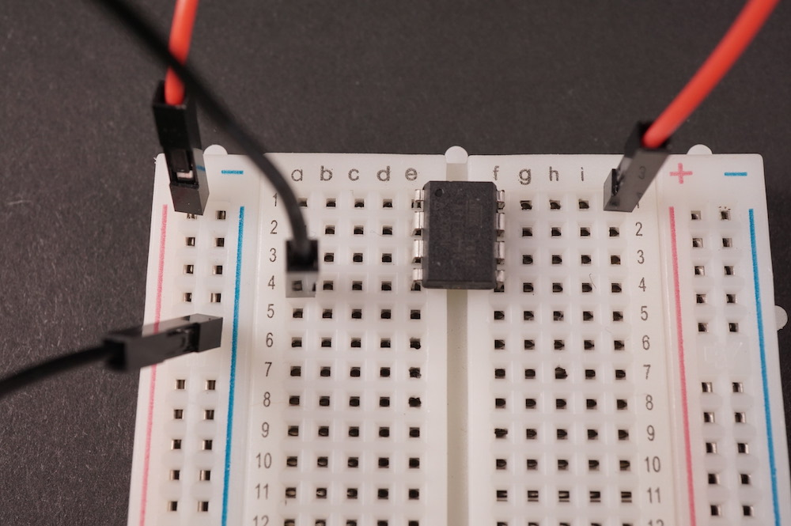
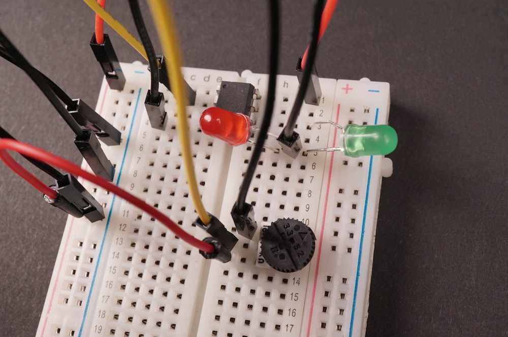

# Spooky Eyes

A (slightly) spooky project for a combined [IDeATe](http://ideate.andrew.cmu.edu) and 
[MechE MakerWing](https://www.cmu.edu/me/news/archive/2015/hamerschlag-makerwing.html)  Halloween 
at Carnegie Mellon University.

When the photosensor sees less light, the lights blink faster, and vice versa. Turn the potentiometer to adjust the blinking rate. It's *super scary*. We can give hugs as needed.

# Let's make it!

## Parts list

* 1 ATTiny85 microcontroller
* 1 5.6kΩ resistor
* 1 photoresistor
* 1 10kΩ potentiometer
* 2 LEDs
* 1 medium solderless breadboard
* ~8 male–male jumper wires
* 6 female–male jumper wires (optional—for extending light sensor and LEDs off the breadboard)
* 1 2032 3V lithium coin cell battery
* 1 coin cell battery holder
* spooky thing to put your LEDs and light sensor onto

## If you are comfortable with electronics and reading a schematic

The Arduino sketch has been preloaded onto the ATTiny85 chip. Just build the circuit as [the 
schematic](spookyEyes_schem.png) indicates, and the LEDs should begin blinking as soon as the chip is powered.

Want to customize the behavior? Great! We have a USB programmer so we can flash new firmware onto 
the ATTiny super easily. Just modify the Arduino sketch and share the code with us, so we can 
upload it for you. (There's a bit of setup to get the programmer to work on each machine, but if 
you want to do the setup on your own machine that's fine too.)

## If you are newer to electronicsland

### 1. Welcome! We're glad you're here.

### 2. Let's start with the ATTiny85 chip, which will drive the whole project. 

The one we're 
supplying has been pre-programmed with instructions to read the ambient light level and combine 
that with information from the potentiometer to establish the rate at which the LEDs will blink.

Put the chip onto the breadboard like so:

**Pay attention to the dot on the chip and make sure it's in the upper left corner!** (In the 
schematic
drawing a half-circle is shown. This at the little dot are interchangeable.)

This tutorial refers to the *software* numbers each of the chip's 
hardware pins use. For instance, if you make an attachment to software `pin 0`, that means the 
chip's lower right pin, which has hardware number 5. Here's a schematic of the chip showing the 
hardware and software numbers:

Image from Sparkfun, shared under the [CC BY-SA 4.0 
license](https://creativecommons.org/licenses/by-sa/4.0/)

Let's give the chip power: use a jumper wire to connect the chip's `5V` pin to the column marked 
with a + and a red line along the edge of the breadboard. Use another jumper to connect the 
chip's `GND` (ground) to the column marked with – and a blue line along the breadboard edge.

### 3. Now we can add some LEDs. 

LEDs have a longer and a shorter leg, because they only work 
when power flows through them in the correct direction. The longer leg is the positive one, and 
the shorter is the negative.

For one LED, plug the long leg into the same row as `pin 0`, and the short leg into another row 
on the breadboard that is not shared with any of the ATTiny pins. For the second LED, plug its 
long leg into `pin 1` and the short leg into that same row as the other's short leg.

Use a jumper wire to connect the short leg row to the ground column (with the – at the top and a 
blue stripe).

### 4. Add the potentiometer

The potentiometer has three legs: two outsides and one in the center. Plug the potentiometer into 
the breadboard so each leg is in a different row (i.e. the legs are oriented up-down along a 
column, not left-right along a row).

Use a jumper wire to connect one of the outside legs to the long column marked with a minus sign, 
and use a second jumper wire to connect the potentiometer's other outside leg to the long column 
marked with a plus sign.

Use a third jumper wire to connect the potentiometer's center pin to ATTiny `pin A3`.

### 5. Add the light sensor

Wire the 5.6kΩ resistor so one leg goes into the long column marked with the minus sign, and the 
other leg goes into any unused row.

Then, wire the photoresistor so that one leg goes into the long column marked with the plus sign, 
and 
the other leg is in the same row the resistor plugs into.

Use a jumper wire to connect that shared row to ATTiny `pin A2`.

### 6. Add power and you're done!

Slide the battery into the battery case, with the positive side (marked with a +) facing up.

This next part is tricky: place the battery case on the breadboard so its negative leg is in the 
negative (– sign and blue stripe) column, and its positive leg is somewhere else on the board.

Then use a jumper to attach the battery's positive leg to the power (red stripe and + sign) 
column.

The lights should start blinking, and if they don't it's time to debug!

## Extending the LEDs and light sensor

If you want the LEDs or light sensor to be somewhere other than the main board, simply use the 
female–male jumper wires like extension cords. Easy!

